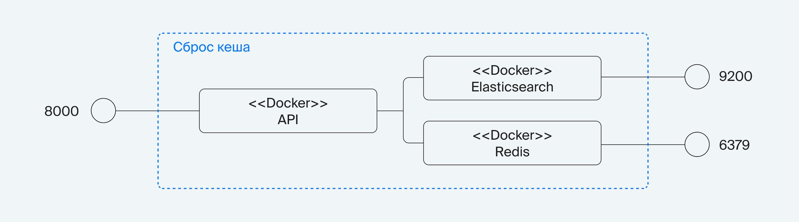
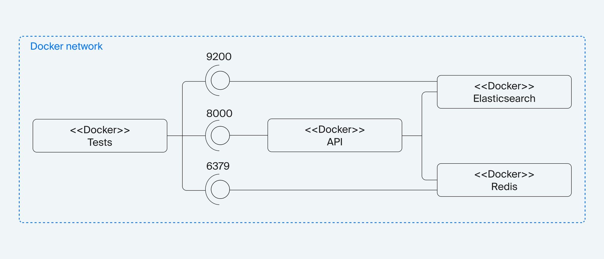

## Как разворачивать сценарии

### 1) Тестируем локально в коде группу контейнеров с Fast API



#### Настройка окружения:
```
cd test/functional
python3 -m venv venv
source venv/bin/activate
```
cоздаём файл **.env** по примеру **.env.example** в той же директории

(для данной сборки просто скопировать и переименовать *)


#### Запуск тестов:
```
docker-compose -f dev-compose.yaml up --build -d
pytest
```

#### После тестов (важно!):
Остановить и удалить контейнеры
```
docker-compose -f dev-compose.yaml down
(docker-compose -f dev-compose.yaml rm если запускали без -d)
```

### 2) Тестируем в Docker



```
cd test/functional (если не в ней уже)
docker-compose up --build
```

Контейнер tests с тестами запускается, дожидается рабочего состояния других контейнеров, проводит тесты и завершает работу.

 
#### * Для себя будущего

Я сделал несколько открытий (для себя :) )
1) dotenv не работает (стабильно) внутри докер контейнеров, что делает его бесполезным вообще. Почему? Потому что в боевой среде docker-compose гарантированно пробрасывает данные из .env в environment самого контейнера, где их точно можно забрать через os.getenv('SOME_VALUE', default_value). Нет необходимости пробрасывать сам .env внутрь контейнера. Ну а dev-машине, пробрасываем порты контейнеров на неё (на localhost) и работаем без .env вообще, применяя default_value.
2) **os.getenv('PORT', 8000)** вернет строку если будет найден ключ **PORT** в окружении, и int, если таковой не будет найден. Что больно ударит контейнере, если не оборачивать всю это выражение дополнительно в int(os.getenv('PORT', 8000))
3) Неизвестно по какой причине, но в данном случае запуск контейнера таким вот **entrypoint** невозможен:
```
#!/bin/bash
python3 tests/functional/wait_for_backend.py
pytest
```
и так не сработает:
```
#!/bin/bash
cd tests/functional
python3 wait_for_backend.py
pytest
```
будет ошибка файл или директория не найдена! Да вот так, ls показывает что директория есть, а пройти в ёё поддиректорию невозможно. Рабочий вариант:
```
#!/bin/bash
cd tests
cd functional
python3 wait_for_backend.py
pytest
```
Х.з. в чем тут дело.

